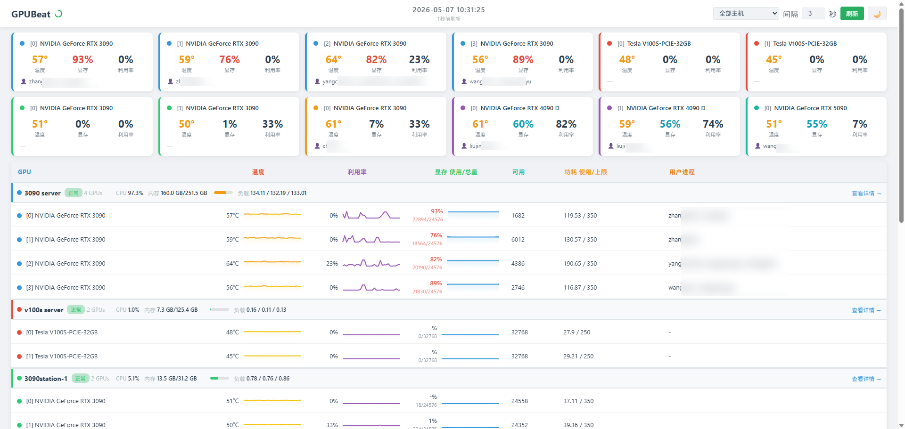
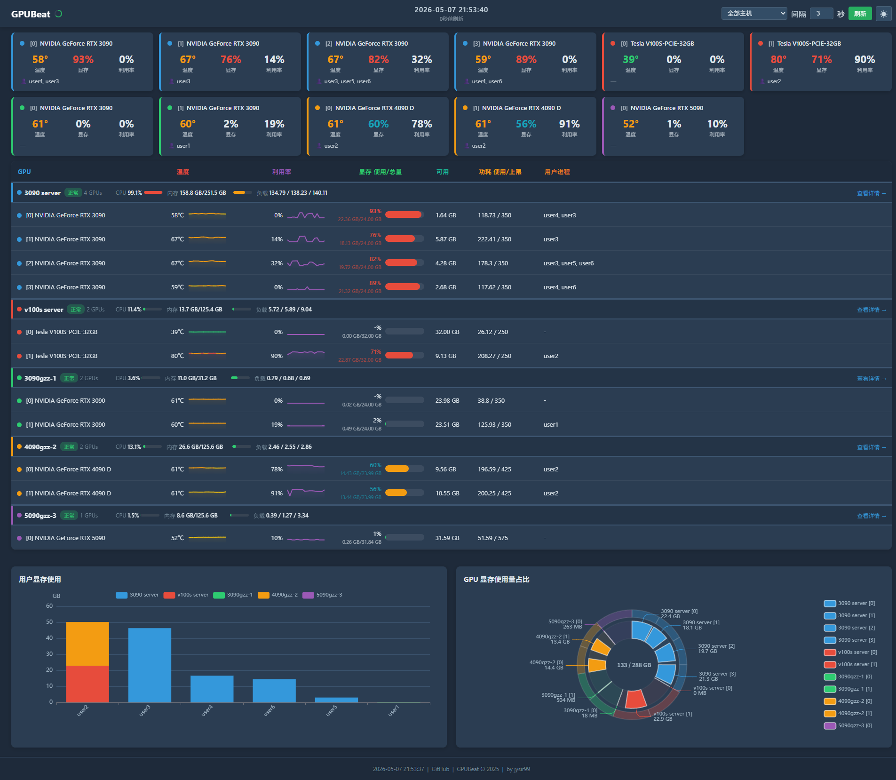

<div align="center">

# 🖥️ GPUBeat

**多服务器 GPU 实时监控看板**

[](https://github.com/jysir99/GPUBeat/releases)
[](https://go.dev)
[](LICENSE)
[](https://github.com/jysir99/GPUBeat/releases)

基于 SSH + nvidia-smi 的轻量级 GPU 集群监控工具，Go 单二进制部署，零依赖，开箱即用

[English](#english) | [中文](#中文)

</div>

---

## 中文

GPUBeat 通过 SSH 连接远程服务器执行 `nvidia-smi`，将多台 GPU 服务器的状态集中展示在 Web 看板上。采用连接池复用 SSH 连接，支持断线自动重连，多用户访问不增加 SSH 负担。

### ✨ 特性

- 🌐 **多服务器** — 同时监控多台 GPU 服务器，统一看板展示，支持按主机筛选
- 📊 **GPU 状态** — 温度、利用率、显存、功耗实时展示，温度按值自动着色
- 🔍 **进程追踪** — 显示每块 GPU 上的进程、所属用户及显存占用
- 🖧 **系统信息** — CPU 使用率、内存占用、系统负载一键查看
- 📈 **可视化** — ECharts 饼图、柱状图、Sparkline 趋势图，GPU 详情弹窗
- 🔄 **实时刷新** — 可调刷新间隔（1-60 秒），圆环进度指示器
- 🌓 **明暗主题** — 一键切换 Dark / Light 模式
- 🔌 **连接池** — SSH 连接复用，断线自动重连
- 📝 **日志系统** — 按服务器、按日期记录历史数据
- 📦 **单文件部署** — 前端通过 `go:embed` 嵌入，编译后只需一个二进制 + 配置文件
- ⚡ **零依赖** — 无需 Python、Node.js、Docker 或数据库

### 📸 截图

|              亮色模式              |
| :--------------------------------: |
|      |

|           暗色模式           |
| :--------------------------: |
|  |

### 🚀 快速开始

#### 下载

从 [Releases](https://github.com/jysir99/GPUBeat/releases) 下载对应平台的二进制文件：

| 平台                | 文件                        |
| ------------------- | --------------------------- |
| Linux x86_64        | `gpubeat-linux-amd64`       |
| Linux ARM64         | `gpubeat-linux-arm64`       |
| Windows x86_64      | `gpubeat-windows-amd64.exe` |
| macOS Intel         | `gpubeat-darwin-amd64`      |
| macOS Apple Silicon | `gpubeat-darwin-arm64`      |

#### 从源码编译

```bash
git clone https://github.com/jysir99/GPUBeat.git
cd GPUBeat
make build
```

#### 配置

```bash
cp config.example.yaml config.yaml
```

编辑 `config.yaml`：

```yaml
server:
  host: "0.0.0.0" # 监听地址
  port: 9988 # 监听端口
  refresh: 3 # 刷新间隔（秒）
  privacy: false # 隐私模式：将实际用户名替换为 user1, user2 等

hosts:
  - name: "gpu-server-1"
    host: "192.168.1.100"
    port: 22
    username: "root"
    password: "your-password"

  - name: "gpu-server-2"
    host: "192.168.1.101"
    port: 22
    username: "user"
    password: "password"
```

#### 运行

```bash
chmod +x gpubeat         # Linux/macOS
./gpubeat                # 读取同目录 config.yaml
./gpubeat -c /path/to.yaml  # 指定配置路径
./gpubeat -privacy       # 启用隐私模式
./gpubeat -h             # 显示帮助信息
```

Windows 下双击 `gpubeat.exe` 或在命令行运行即可。

打开浏览器访问 `http://localhost:9988` 🎉

### 🏗️ 架构

```
  浏览器 ──HTTP──▶ Go 服务 ──内存缓存──▶ 多用户零 SSH 开销
                       │
                  后台刷新（每 N 秒）
                       │
               SSH 连接池（每服务器持久连接）
                  ┌────┼────┐
                  │    │    │
              Server1 Server2 Server3
              nvidia-smi（GPU + 进程 + 系统信息）
```

### 📂 项目结构

```
├── main.go              # 入口，后台刷新调度
├── config.go            # YAML 配置加载
├── ssh.go               # SSH 连接池，断线重连
├── gpu.go               # nvidia-smi 输出解析
├── handler.go           # HTTP 路由，embed 嵌入
├── logger.go            # 按服务器按日期日志
├── web/
│   └── index.html       # Vue 2 + ECharts 单页应用
├── config.example.yaml  # 配置示例
├── Makefile             # 构建脚本
└── .github/workflows/
    └── release.yml      # GitHub Actions 自动发布
```

### 🛠️ 技术栈

| 层   | 技术                          |
| ---- | ----------------------------- |
| 后端 | Go 1.23, crypto/ssh, go:embed |
| 前端 | Vue 2, ECharts, 原生 CSS      |
| 部署 | 单二进制, 跨平台交叉编译      |

### 🤝 参与贡献

欢迎提交 Issue 和 Pull Request！

### 📄 开源许可

[MIT License](LICENSE)

---

<a id="english"></a>

## English

GPUBeat is a lightweight GPU cluster monitoring dashboard that connects to remote servers via SSH and collects GPU status through `nvidia-smi`. It features an SSH connection pool with automatic reconnection, presenting all servers in a unified web dashboard. Multi-user access adds zero SSH overhead.

### ✨ Features

- 🌐 **Multi-server** — Monitor multiple GPU servers from a single dashboard with per-host filtering
- 📊 **GPU Metrics** — Temperature, utilization, VRAM, power draw with temperature-based coloring
- 🔍 **Process Tracking** — Show processes on each GPU, their owners and memory usage
- 🖧 **System Info** — CPU usage, memory usage, system load averages
- 📈 **Visualization** — ECharts pie charts, bar charts, sparkline trends, GPU detail modal
- 🔄 **Real-time Refresh** — Adjustable interval (1-60s) with circular progress indicator
- 🌓 **Themes** — One-click Dark / Light mode toggle
- 🔌 **Connection Pool** — Persistent SSH connections with auto-reconnect
- 📝 **Logging** — Per-server, per-day historical data logging
- 📦 **Single Binary** — Frontend embedded via `go:embed`, deploy with just one binary + config
- ⚡ **Zero Dependencies** — No Python, Node.js, Docker or database required

### 📸 Screenshots

|              Light Mode              |
| :--------------------------------: |
|      |

|           Dark Mode           |
| :--------------------------: |
|  |


### 🚀 Quick Start

#### Download

Grab the binary for your platform from [Releases](https://github.com/jysir99/GPUBeat/releases):

| Platform            | File                        |
| ------------------- | --------------------------- |
| Linux x86_64        | `gpubeat-linux-amd64`       |
| Linux ARM64         | `gpubeat-linux-arm64`       |
| Windows x86_64      | `gpubeat-windows-amd64.exe` |
| macOS Intel         | `gpubeat-darwin-amd64`      |
| macOS Apple Silicon | `gpubeat-darwin-arm64`      |

#### Build from Source

```bash
git clone https://github.com/jysir99/GPUBeat.git
cd GPUBeat
make build
```

#### Configure

```bash
cp config.example.yaml config.yaml
```

Edit `config.yaml` with your server SSH credentials:

```yaml
server:
  host: "0.0.0.0" # listen address
  port: 9988 # listen port
  refresh: 3 # refresh interval in seconds
  privacy: false # privacy mode: replace real usernames with user1, user2, etc.
  terminal:
    enabled: false # set true to enable browser SSH terminals for configured hosts
    token: "" # optional shared token required by the Web Terminal

hosts:
  - name: "gpu-server-1"
    host: "192.168.1.100"
    port: 22
    username: "root"
    password: "your-password"
```

#### Run

```bash
chmod +x gpubeat             # Linux/macOS
./gpubeat                    # reads config.yaml from same directory
./gpubeat -c /path/to.yaml   # specify config path
./gpubeat -privacy           # enable privacy mode
./gpubeat -h                 # show help
```

On Windows, simply double-click `gpubeat.exe` or run it from Command Prompt.

Open your browser and visit `http://localhost:9988` 🎉

### 🏗️ Architecture

```
  Browser ──HTTP──▶ Go Server ──Memory Cache──▶ Zero SSH overhead for multi-user
                         │
                    Background Refresh (every N seconds)
                         │
                 SSH Connection Pool (persistent per server)
                    ┌────┼────┐
                    │    │    │
                Server1 Server2 Server3
                nvidia-smi (GPU + Processes + System Info)
```

### 🛠️ Tech Stack

| Layer    | Technology                                |
| -------- | ----------------------------------------- |
| Backend  | Go 1.23, crypto/ssh, go:embed             |
| Frontend | Vue 2, ECharts, Vanilla CSS               |
| Deploy   | Single binary, cross-platform compilation |

### 🤝 Contributing

Issues and Pull Requests are welcome!

### 📄 License

[MIT License](LICENSE)
