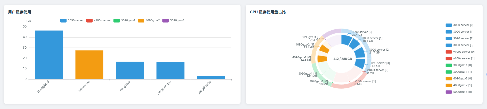

<div align="center">

# 🖥️ GPUBeat

**多服务器 GPU 实时监控看板**

基于 SSH + nvidia-smi 的轻量级 GPU 集群监控工具，Go 单二进制部署，零依赖

[English](#english) | [中文](#中文)

</div>

---

## 📖 中文

GPUBeat 通过 SSH 连接远程服务器执行 `nvidia-smi`，将多台 GPU 服务器的状态集中展示在 Web 看板上。采用连接池复用 SSH 连接，支持断线自动重连。

### ✨ 特性

- 🌐 **多服务器** — 同时监控多台 GPU 服务器，统一看板展示
- 📊 **GPU 状态** — 温度、利用率、显存、功耗、进程及用户追踪
- 🖧 **系统信息** — CPU 使用率、内存占用、系统负载
- 📈 **可视化** — ECharts 饼图、柱状图、折线趋势，温度按值自动着色
- 🔌 **连接池** — SSH 连接复用，断线自动重连，多用户访问不增加 SSH 负担
- 📝 **日志系统** — 按服务器、按日期记录历史数据
- 📦 **单文件部署** — 前端通过 `go:embed` 嵌入，编译后只需一个二进制 + 配置文件

### 📸 截图





### 🚀 快速开始

**编译**

```bash
make build
```

**配置**

```bash
cp config.example.yaml config.yaml
```

```yaml
server:
  host: "0.0.0.0"
  port: 9988
  refresh: 3

hosts:
  - name: "gpu-server-1"
    host: "192.168.1.100"
    port: 22
    username: "root"
    password: "your-password"
```

**运行**

```bash
./gpubeat                  # 读同目录 config.yaml
./gpubeat -c /path/to.yaml # 指定配置路径
```

访问 `http://localhost:9988` 🎉

### 🏗️ 架构

```
浏览器 ──HTTP──▶ Go 服务 ──内存缓存──▶ 多用户零 SSH 开销
                    │
               后台刷新（每 N 秒）
                    │
            SSH 连接池（每服务器持久连接）
                    │
            nvidia-smi（GPU + 进程 + 系统信息）
```

### 📂 项目结构

```
├── main.go              # 入口，后台刷新调度
├── config.go            # YAML 配置加载
├── ssh.go               # SSH 连接池，断线重连
├── gpu.go               # nvidia-smi 输出解析
├── handler.go           # HTTP 路由，embed 嵌入
├── logger.go            # 按服务器按日期日志
├── web/
│   └── index.html       # Vue 2 + ECharts 单页
└── config.example.yaml  # 配置示例
```

### 🛠️ 技术栈

`Go` · `Vue 2` · `ECharts` · `SSH` · `go:embed`

### 📄 开源许可

[MIT License](LICENSE)

---

<a id="english"></a>

## 📖 English

GPUBeat is a lightweight GPU cluster monitoring dashboard that connects to remote servers via SSH and collects GPU status through `nvidia-smi`. It features an SSH connection pool with automatic reconnection, presenting all servers in a unified web dashboard.

### ✨ Features

- 🌐 **Multi-server** — Monitor multiple GPU servers from a single dashboard
- 📊 **GPU Metrics** — Temperature, utilization, VRAM, power draw, processes & user tracking
- 🖧 **System Info** — CPU usage, memory usage, system load averages
- 📈 **Visualization** — ECharts pie charts, bar charts, trend lines with temperature-based coloring
- 🔌 **Connection Pool** — Persistent SSH connections with auto-reconnect; multi-user access adds zero SSH overhead
- 📝 **Logging** — Per-server, per-day historical data logging
- 📦 **Single Binary** — Frontend embedded via `go:embed`, deploy with just one binary + config file

### 🚀 Quick Start

**Build**

```bash
make build
```

**Configure**

```bash
cp config.example.yaml config.yaml
```

Edit `config.yaml` with your server SSH credentials.

**Run**

```bash
./gpubeat                  # reads config.yaml from same directory
./gpubeat -c /path/to.yaml # specify config path
```

Open `http://localhost:9988` 🎉

### 🛠️ Tech Stack

`Go` · `Vue 2` · `ECharts` · `SSH` · `go:embed`

### 📄 License

[MIT License](LICENSE)
